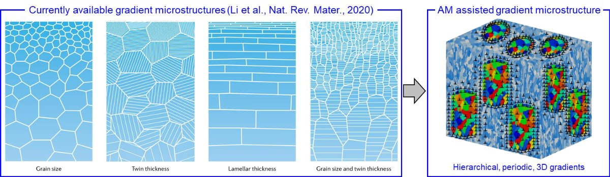

<h1 align="center">HIGMAM ERC Project</h1>

<p align="center">
  <strong>Breaking the strength–ductility trade-off through integrated computational and data-driven design of hierarchical gradient metals</strong>
</p>

---

## About

**HIGMAM** develops computational and experimental methods for designing stronger, tougher metallic materials made by additive manufacturing.

The project focuses on **hierarchical gradient microstructures**: internal material structures whose grains, phases, substructures, and defects vary deliberately across space.

The goal is direct material design:

```text
process → microstructure → properties
```

<div align="center">
  
<p align="center">
  
</p>

</div>

---

## Approach

HIGMAM combines experimental research, computational mechanics, and data-assisted analysis to study metallic materials across different length scales.

The work brings together:

- advanced material characterization,
- mechanical testing,
- finite-element modelling,
- micromechanics and crystal plasticity,
- damage and fracture analysis,
- machine-learning-assisted interpretation and design.

The public repositories in this organization provide selected datasets, scripts, and computational workflows that support open and reproducible research.

---

## Publications

Selected publications related to HIGMAM and the broader research activities of the group are listed below.

| Authors | Year | Title | Journal | Status |
|---|---:|---|---|---|
| Lian et al. | YYYY | Title to be added | Journal to be added | Published |
| Author et al. | YYYY | Title to be added | Journal to be added | Preprint |
| Author et al. | YYYY | Title to be added | Journal to be added | Submitted |

---

## Keywords

`additive manufacturing` · `LPBF` · `gradient microstructure` · `crystal plasticity` · `micromechanics` · `damage` · `fracture` · `ICME` · `machine learning`

---

## Project team

**Principal investigator:** Prof. Junhe Lian  
Email: [junhe.lian@ibf.rwth-aachen.de](mailto:junhe.lian@ibf.rwth-aachen.de)

**Members:**

- Binh Xuan Nguyen — Main GitHub maintainer  
  Email: [binh.nguyen@ibf.rwth-aachen.de](mailto:binh.nguyen@ibf.rwth-aachen.de)

- Yanglang Yuan — Main GitHub maintainer  
  Email: [yanglang.yuan@ibf.rwth-aachen.de](mailto:yanglang.yuan@ibf.rwth-aachen.de)
